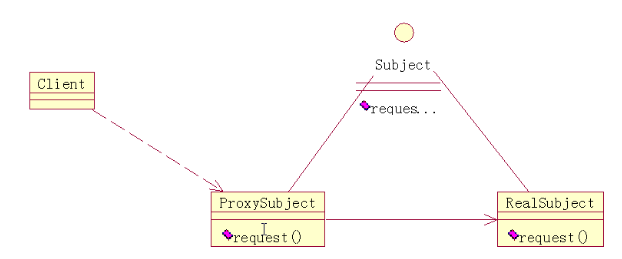

# 主要介绍

1. 静态代理模式
2. 动态代理
3. CGLIB

## 静态代理模式



```java
interface Hosee{
	String sayhi();
}

class Hoseeimpl implements Hosee{

	@Override
	public String sayhi()
	{
		return "Welcome";
	}
	
}

class HoseeProxy implements Hosee{

	Hosee h;
	
	public HoseeProxy(Hosee h)
	{
		this.h = h;
	}
	
	@Override
	public String sayhi()
	{
		System.out.println("I'm proxy!");
		return h.sayhi();
	}
	
}


public class StaticProxy
{

	public static void main(String[] args)
	{
		Hoseeimpl h = new Hoseeimpl();
		HoseeProxy hp = new HoseeProxy(h);
		System.out.println(hp.sayhi());
	}

}

```

## 动态代理

```JAVA
import java.lang.reflect.InvocationHandler;
import java.lang.reflect.Method;
import java.lang.reflect.Proxy;

interface HoseeDynamic
{
	String sayhi();
}

class HoseeDynamicimpl implements HoseeDynamic
{
	@Override
	public String sayhi()
	{
		return "Welcome oschina hosee's blog";
	}
}

class MyProxy implements InvocationHandler
{
	Object obj;
	public Object bind(Object obj)
	{
		this.obj = obj;
		return Proxy.newProxyInstance(obj.getClass().getClassLoader(), obj
				.getClass().getInterfaces(), this);
	}
	@Override
	public Object invoke(Object proxy, Method method, Object[] args)
			throws Throwable
	{
		System.out.println("I'm proxy!");
		Object res = method.invoke(obj, args);
		return res;
	}
}

public class DynamicProxy
{
	public static void main(String[] args)
	{
		MyProxy myproxy = new MyProxy();
		HoseeDynamicimpl dynamicimpl = new HoseeDynamicimpl();
		HoseeDynamic proxy = (HoseeDynamic)myproxy.bind(dynamicimpl);
		System.out.println(proxy.sayhi());
	}
}

```

类比静态代理，可以发现，代理类不需要实现原接口了，而是实现InvocationHandler。通过

```JAVA
Proxy.newProxyInstance(obj.getClass().getClassLoader(), obj
				.getClass().getInterfaces(), this);
```

来动态生成一个代理类，该类的类加载器与被代理类相同，实现的接口与被代理类相同。通过上述方法生成的代理类相当于静态代理中的代理类。这样就实现了在运行期才决定代理对象是怎么样的，解决了静态代理的弊端。

当动态生成的代理类调用方法时，会触发invoke方法，在invoke方法中可以对被代理类的方法进行增强。

通过动态代理可以很明显的看到它的好处，在使用静态代理时，如果不同接口的某些类想使用代理模式来实现相同的功能，将要实现多个代理类，但在动态代理中，只需要一个代理类就好了。

除了省去了编写代理类的工作量，动态代理实现了可以在原始类和接口还未知的时候，就确定代理类的代理行为，当代理类与原始类脱离直接联系后，就可以很灵活地重用于不同的应用场景中。

### 动态代理的弊端

代理类和委托类需要都实现同一个接口。也就是说只有实现了某个接口的类可以使用Java动态代理机制。但是，事实上使用中并不是遇到的所有类都会给你实现一个接口。因此，对于没有实现接口的类，就不能使用该机制。  
而CGLIB则可以实现对类的动态代理

### 回调函数的原理

上文说了，当动态生成的代理类调用方法时，会触发invoke方法。

很显然invoke方法并不是显示调用的，它是一个回调函数，那么回调函数是怎么被调用的呢？

上述动态代理的代码中，唯一不清晰的地方只有

```java
Proxy.newProxyInstance(obj.getClass().getClassLoader(), obj
				.getClass().getInterfaces(), this);
```
跟踪这个方法的源码，可以看到程序进行了验证、优化、缓存、同步、生成字节码、显示类加载等操作，前面的步骤并不是我们关注的重点，而最后它调用了

```java
byte[] proxyClassFile = ProxyGenerator.generateProxyClass(
                proxyName, interfaces);
```
该方法用来完成生成字节码的动作，这个方法可以在运行时产生一个描述代理类的字节码byte[]数组。
在main函数中加入

```java
System.getProperties().put("sun.misc.ProxyGenerator.saveGeneratedFiles","true");
```
加入这句代码后再次运行程序，磁盘中将会产生一个名为"$Proxy().class"的代理类Class文件，反编译（反编译工具我使用的是 JD-GUI ）后可以看见如下代码：

```java
import java.lang.reflect.InvocationHandler;
import java.lang.reflect.Method;
import java.lang.reflect.Proxy;
import java.lang.reflect.UndeclaredThrowableException;

public final class $Proxy0 extends Proxy
  implements HoseeDynamic
{
  private static Method m1;
  private static Method m3;
  private static Method m0;
  private static Method m2;

  public $Proxy0(InvocationHandler paramInvocationHandler)
    throws 
  {
    super(paramInvocationHandler);
  }

  public final boolean equals(Object paramObject)
    throws 
  {
    try
    {
      return ((Boolean)this.h.invoke(this, m1, new Object[] { paramObject })).booleanValue();
    }
    catch (Error|RuntimeException localError)
    {
      throw localError;
    }
    catch (Throwable localThrowable)
    {
      throw new UndeclaredThrowableException(localThrowable);
    }
  }

  public final String sayhi()
    throws 
  {
    try
    {
      return (String)this.h.invoke(this, m3, null);
    }
    catch (Error|RuntimeException localError)
    {
      throw localError;
    }
    catch (Throwable localThrowable)
    {
      throw new UndeclaredThrowableException(localThrowable);
    }
  }

  public final int hashCode()
    throws 
  {
    try
    {
      return ((Integer)this.h.invoke(this, m0, null)).intValue();
    }
    catch (Error|RuntimeException localError)
    {
      throw localError;
    }
    catch (Throwable localThrowable)
    {
      throw new UndeclaredThrowableException(localThrowable);
    }
  }

  public final String toString()
    throws 
  {
    try
    {
      return (String)this.h.invoke(this, m2, null);
    }
    catch (Error|RuntimeException localError)
    {
      throw localError;
    }
    catch (Throwable localThrowable)
    {
      throw new UndeclaredThrowableException(localThrowable);
    }
  }

  static
  {
    try
    {
      m1 = Class.forName("java.lang.Object").getMethod("equals", new Class[] { Class.forName("java.lang.Object") });
      m3 = Class.forName("HoseeDynamic").getMethod("sayhi", new Class[0]);
      m0 = Class.forName("java.lang.Object").getMethod("hashCode", new Class[0]);
      m2 = Class.forName("java.lang.Object").getMethod("toString", new Class[0]);
      return;
    }
    catch (NoSuchMethodException localNoSuchMethodException)
    {
      throw new NoSuchMethodError(localNoSuchMethodException.getMessage());
    }
    catch (ClassNotFoundException localClassNotFoundException)
    {
      throw new NoClassDefFoundError(localClassNotFoundException.getMessage());
    }
  }
}
```
动态代理类不仅代理了显示定义的接口中的方法，而且还代理了java的根类Object中的继承而来的equals()、hashcode()、toString()这三个方法，并且仅此三个方法。 
可以在上述代码中看到，无论调用哪个方法，都会调用到InvocationHandler的invoke方法，只是参数不同。

### 动态代理与静态代理的区别

* Proxy类的代码被固定下来，不会因为业务的逐渐庞大而庞大；
* 可以实现AOP编程，这是静态代理无法实现的；
* 解耦，如果用在web业务下，可以实现数据层和业务层的分离。
* 动态代理的优势就是实现无侵入式的代码扩展。 静态代理这个模式本身有个大问题，如果类方法数量越来越多的时候，代理类的代码量是十分庞大的。所以引入动态代理来解决此类问题

## CGLIB

cglib是针对类来实现代理的，他的原理是对指定的目标类生成一个子类，并覆盖其中方法实现增强，但因为采用的是继承，所以**不能对final修饰**的类进行代理。

```java
import java.lang.reflect.Method;

import net.sf.cglib.proxy.Enhancer;
import net.sf.cglib.proxy.MethodInterceptor;
import net.sf.cglib.proxy.MethodProxy;

class CGlibHosee
{
	public String sayhi()
	{
		return "Welcome oschina hosee's blog";
	}
}

class CGlibHoseeProxy
{
	Object obj;

	public Object bind(final Object target)
	{
		this.obj = target;
		Enhancer enhancer = new Enhancer();
		enhancer.setSuperclass(obj.getClass());
		enhancer.setCallback(new MethodInterceptor()
		{
			@Override
			public Object intercept(Object obj, Method method, Object[] args,
					MethodProxy proxy) throws Throwable
			{
				System.out.println("I'm proxy!");
				Object res = method.invoke(target, args);
				return res;
			}
		});
		return enhancer.create();
	}

}

public class CGlibProxy
{
	public static void main(String[] args)
	{
		CGlibHosee cGlibHosee = new CGlibHosee();
		CGlibHoseeProxy cGlibHoseeProxy = new CGlibHoseeProxy();
		CGlibHosee proxy = (CGlibHosee) cGlibHoseeProxy.bind(cGlibHosee);
		System.out.println(proxy.sayhi());
	}
}
```
cglib需要指定父类和回调方法。当然cglib也可以与Java动态代理一样面向接口，因为本质是继承。