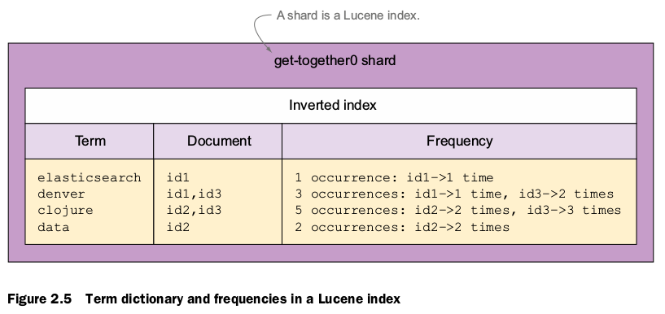

# 介绍

## 三种典型的场景

* 作为网站的后端存储
* 作为现有系统的一部分，作为查询系统
* 独立于现有系统

*elastic index 示例*

```JSON
{
"message": "logging to Elasticsearch for the first time",
"timestamp": "2013-08-05T10:34:00"
}
```

*查询请求示例*

```JSON
{
"query": {
"match": {
"message": "first"
   }
 }
}
```
## Elastice 主要的功能点

* 非常容易访问Lucene的索引和数据查询的功能
* 丰富的处理数据索引的方法，在查询的时候可以进行过滤条件的组合进行查询
* JSON和REST API接口设计(改变document建立索引的方式)
* 可以提供搜索建议

# 

在Elasticsearch中，文档归属于一种类型(type),而这些类型存在于索引(index)中，我们可以画一些简单的对比图来类比传统关系型数据库：

Relational DB -> Databases -> Tables -> Rows -> Columns
Elasticsearch -> Indices   -> Types  -> Documents -> Fields

## 逻辑结构和物理结构


## 理解物理逻辑层的documents,types,indices 


### Documents

* 自包含：包含字段和它的值
* 可以分层：就是数据之间的嵌套（JSON数据的嵌套）

```JSON
{
"name": "Elasticsearch Denver",
"organizer": "Lee",
"location": {
"name": "Denver, Colorado, USA",
"geolocation": "39.7392, -104.9847"
}
}
```
* 不规则的结构：没有预定义的语法（像关系型数据库的表那样）

### Types

类似与面向对象，例如可以定义不同的类型：人/书...
每一个字段（files)在类型里叫做*mapping*,同一个type的所有的documents并不一定需要包含所有的字段，如果新来了一个document包含了一个新的字段（files），那么会行增加一个mapping,并解析它的类型

> **Tips**
> 如果你搜索的字段不是JSON的根字段，查询时需要指明路径例如：location.geolocation

### Indices
index 独立于文档(Document),每一索引（index）包含了对应的文档以及文档所有的字段（files),每一个索引（index）包含一个重建索引的时间间隔（refresh_interv），因为如果添加了文档就重建索引，讲会非常耗时，默认该变量的值为1秒。

**TIP**
> 可以在不同的类型（types）之间进行数据的查询，也可以在相同的索引不同的类型（types）中进行查询

## 物理逻辑层的节点（nodes）和分片（shards）


* node
* cluster
* shard

*当搜索时发生了什么*
> 找到当前索引（index）一系列的分片（shard），这些分片可以是主分片也可以是复制的分片，进行查询

**分片（shard）的一些性质**
* 一个分片是一个Lucene index：一个包含反向索引的目录文件。反向索引（inverted index）：是lucene的一种数据结构可以让我们在不访问文档（Document）的前提下定位到文档的位置



* 主分片只有一个可以设置多个复制分片(可以在运行期间进行分片的添加或删除)，设置多个复制分片可以提高查询的效率，主分片挂掉后可以从复制分片中选出复制分片作为新的主分片
* 分片可以在集群中（cluster）进行分发，前提是各个节点（node）之间进行连通

## 建立索引

采用cURL通过HTTP传输数据


*添加数据*

```
% curl -XPUT 'localhost:9200/get-together/group/1?pretty' -d '{
"name": "Elasticsearch Denver",
"organizer": "Lee"
}
```

*输出数据*
```
{
"_index" : "get-together",
"_type" : "group",
"_id" : "1",
"_version" : 1,
"created" : true
}
```

* 不需要建立索引"get-together"
* 不需要定义类型

*得到mapping*

```
命令 
% curl 'localhost:9200/get-together/_mapping/group?pretty'

输出：

{
"get-together" : {
"mappings" : {
"group" : {
"properties" : {
"name" : {
"type" : "string"
},
"organizer" : {
"type" : "string"
}
}
}
}
}
}
```

*搜索*

```
搜索指定索引（index）指定分类（type）
% curl "localhost:9200/get-together/group/_search?\
q=elasticsearch\
&fields=name,location\
&size=1\
&pretty"

搜索指定索引多个分类
% curl "localhost:9200/get-together/group,event/_search\
?q=elasticsearch&pretty"

搜索指定索引
% curl 'localhost:9200/get-together/_search?q=sample&pretty'

搜索所有索引
% curl 'localhost:9200/_search?q=elasticsearch&pretty'

搜索所有索引下的指定的分类
http://localhost:9200/_all/event/_search
```

# Indexing,updating,and deleting 数据

*定义一个新的类型（type）*
```
curl -XPUT 'localhost:9200/get-together/new-events/1' -d '{
"name": "Late Night with Elasticsearch",
"date": "2013-10-25T19:00"
}'

* 给新的类型添加mapping

curl -XPUT 'localhost:9200/get-together/_mapping/new-events' -d '{
"new-events" : {
  "properties" : {
    "host": {
      "type" : "string"
     }
   }
  }
}

* 查询新建类型的mapping

curl 'localhost:32769/get-together/_mapping/new-events?pretty'
```

> **TIP** 尝试给已存在的字段（file）赋值新的数据类型将会报错


TODO:

Listing 3.2 Trying to change an existing field type from string to long fails
时间类型
Use a predefined date format. For example, the date format parses dates as 2013-
02-25 . Many predefined formats are available, and you can see them all here:
www.elastic.co/guide/reference/mapping/date-format/
Specify your own custom format. You can specify a pattern for timestamps to follow.
For example, specifying MMM YYYY parses dates as Jul 2001 .


_source
_all

:wq

