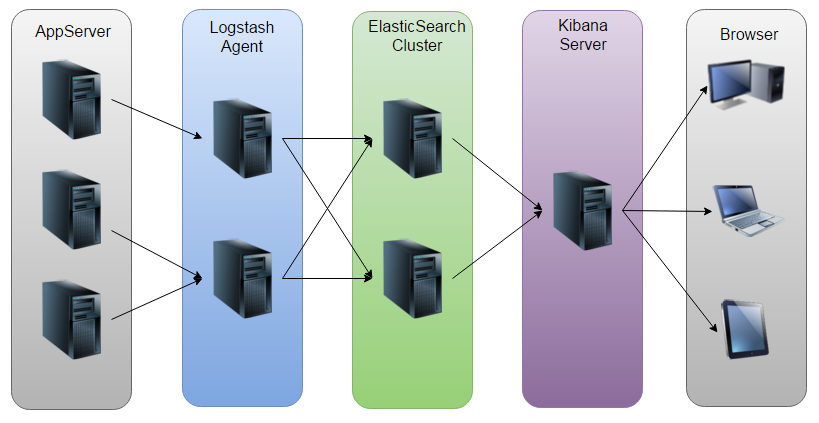

[TOC]

#elk 相关资料

* Elasticsearch是个开源分布式搜索引擎，它的特点有：分布式，零配置，自动发现，索引自动分片，索引副本机制，restful风格接口，多数据源，自动搜索负载等。
* Logstash是一个完全开源的工具，他可以对你的日志进行收集、过滤，并将其存储供以后使用（如，搜索）。
* Kibana 也是一个开源和免费的工具，它Kibana可以为 Logstash 和 ElasticSearch 提供的日志分析友好的 Web 界面

下边是原理图:


## elasticsearch 相关

### 集群（cluster）

一个ES集群可以由一个或者多个节点（nodes or servers）组成。所有这些节点用来存储所有的数据以及提供联合索引，为我们提供跨节点查询的能力。一个ES集群的名称是唯一的，默认情况下为“elasticsearch”。这个名称非常重要，因为一个节点（node）会通过这个名称来判断是否加入已有的集群。


### 节点（Node）

一个节点是一个集群中的一台服务器，它用来存储数据，参与集群的索引以及提供搜索能力。如ES集群，一个节点也是由它的唯一名称来标识，默认状态下，ES会为在启动时随机为一个节点给定一个以漫威Marvel人物的名字为之命名，当然我们也可以为节点指定任何我们想指定的名称。这个名称对于管理ES集群非常重要，我们用它来定位网络或集群中的某一节点。


### 索引（Index）

一个索引是一组具有相似特性的文档的集合。例如，可以为客户数据（customer data）建立一个索引，也可以为产品目录（product catalog）建立另一个索引，还可以为订单数据（order data）建立另一个索引。一个索引由它的名称唯一标识（必须所有字母为小写字母），这个名称会在进行索引（indexing）、搜索（search）、修改（update）和删除（delete）操作的时候使用。


### 类型（Type）

在一个索引下，我们可以定义一个或多个类型（types）。一个类型是一个索引逻辑分类或分区（category/partition），而分类或分区的划分方法由我们自己决定。通常情况下，我们会为具有相类似的字段的一组文档定义类型。比如，如果我们运行一个博客平台，所有的数据都使用同一索引，我们为用户数据定义一种类型，为博客数据定义另一种类型，同时为评论数据定义另一种类型。

### 文档（Document）

一个文档是一个可以被索引的基本信息单元。比如，一个用户可以是一个文档，一个产品可以是一个文档，一个订单同样也可以成为一个文档。这个文档以JSON格式表示。

### 分片与副本（Shards & Replicas）

一个索引可能会存储大量数据从而超过单个节点硬件的限制。例如，单个索引可能会有上亿的文档占用1TB的磁盘空间，这对于单个节点来说太大，同时使用单个节点也会是搜索变慢。

为了解决这个问题，ES提供了一种分片（shard）能力，让我们将一个索引切分成片。当我们创建一个索引时，我们可以为它指定分片的数量。每个分片自己都能独立工作，并且存在与集群的任一节点中。


## logstash 基础

### 输入插件

``` JSON
input {
    stdin {
        type => "web"
    }
}
filter {
    if [type] == "web" {
        grok {
            match => ["message", %{COMBINEDAPACHELOG}]
        }
    }
}
output {
    if "_grokparsefailure" in [tags] {
        nagios_nsca {
            nagios_status => "1"
        }
    } else {
        elasticsearch {
        }
    }
}
```
#### 读取文件（file)

*配置示例*

```JSON
input
    file {
        path => ["/var/log/*.log", "/var/log/message"]
        type => "system"
        start_position => "beginning"
    }
}
```
*配置参数*

* discover_interval
  logstash 每隔多久去检查一次被监听的 path 下是否有新文件。默认值是 15 秒。
* exclude
  不想被监听的文件可以排除出去，这里跟 path 一样支持 glob 展开。
* start_position
  logstash 从什么位置开始读取文件数据，默认是结束位置，也就是说 logstash 进程会以类似 tail -F 的形式运行。如果你是要导入原有数据，把这个设定改成 "beginning"，logstash 进程就从头开始读取，有点类似 cat，但是读到最后一行不会终止，而是继续变成 tail -F。

#### 读取网络数据(TCP)

*配置示例*

```JSON
input {
    tcp {
        port => 8888
        mode => "server"
        ssl_enable => false
    }
}
```
#### 读取Redis数据

*配置示例*
```JSON
input {
    redis {
        data_type => "pattern_channel"
        key => "logstash-*"
        host => "192.168.0.2"
        port => 6379
        threads => 5
    }
}
```
*redis示例数据*

```JSON
127.0.0.1:6379> PUBLISH logstash-chan '{"message":"hello world","@version":"1","@timestamp":"2014-08-08T16:34:21.865Z","host":"raochenlindeMacBook-Air.local","key1":"value1"}'
```
### 编码插件（Codec）

Logstash 不只是一个input | filter | output 的数据流，而是一个 input | decode | filter | encode | output 的数据流！codec 就是用来 decode、encode 事件的。

#### JSON编码

*配置示例*

```JSON
input {
    file {
        path => "/var/log/nginx/access.log_json""
        codec => "json"
    }
}
```
### 过滤器插件

#### grok 正则捕获

正则匹配插件

*配置示例*
```JSON
input {stdin{}}
filter {
    grok {
        match => {
            "message" => "\s+(?<request_time>\d+(?:\.\d+)?)\s+"
        }
    }
}
output {stdout{}}
```
*输出示例*

```JSON
{
         "message" => "begin 123.456 end",
        "@version" => "1",
      "@timestamp" => "2014-08-09T11:55:38.186Z",
            "host" => "raochenlindeMacBook-Air.local",
    "request_time" => "123.456"
}
```

[Grok表达式语法](https://github.com/logstash/logstash/tree/v1.4.2/patterns)

*使用grok预定义的表达式*
```JSON
filter {
    grok {
        match => {
            "message" => "%{WORD} %{NUMBER:request_time:float} %{WORD}"
        }
    }
}
```
*输出的数据*
```JSON
filter {
    grok {
        match => {
            "message" => "%{WORD} %{NUMBER:request_time:float} %{WORD}"
        }
    }
}
```

####JSON 解码

*配置示例*

```JSON
filter {
    json {
        source => "message"
        target => "jsoncontent"
    }
}
```

*输出结果*

```JSON
{
    "@version": "1",
    "@timestamp": "2014-11-18T08:11:33.000Z",
    "host": "web121.mweibo.tc.sinanode.com",
    "message": "{\"uid\":3081609001,\"type\":\"signal\"}",
    "jsoncontent": {  #如果不使用 target目标 这一层是可以去掉的
        "uid": 3081609001,
        "type": "signal"
    }
}
```
### 输出插件
#### stdout
#### file
#### elasticsearch

*配置示例*

```JSON
output {
    elasticsearch {
        host => "192.168.0.2"
        protocol => "http"
        index => "logstash-%{type}-%{+YYYY.MM.dd}"
        index_type => "%{type}"
        workers => 5
        template_overwrite => true
    }
}
```
